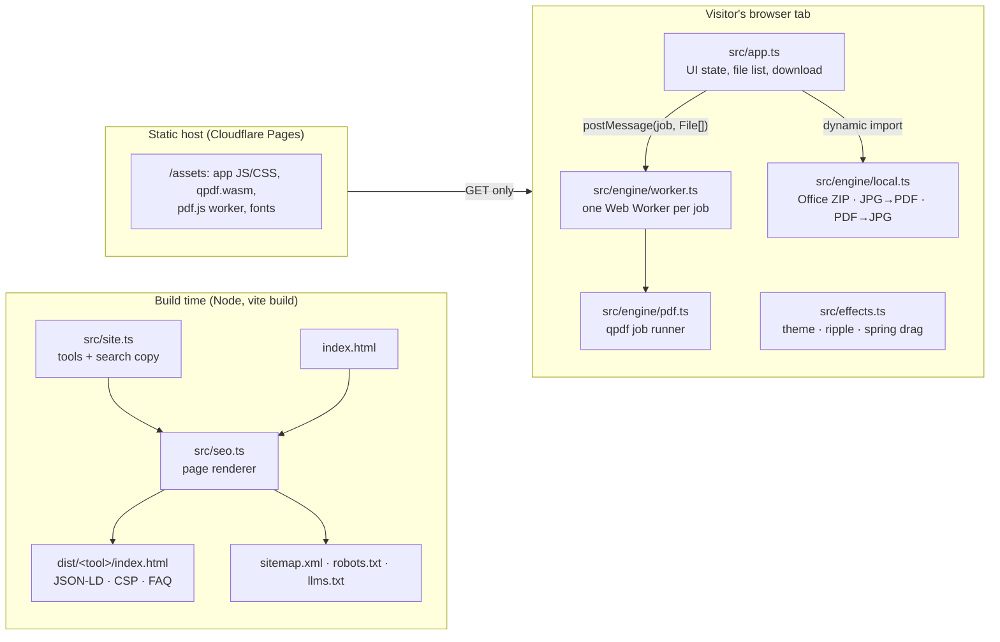
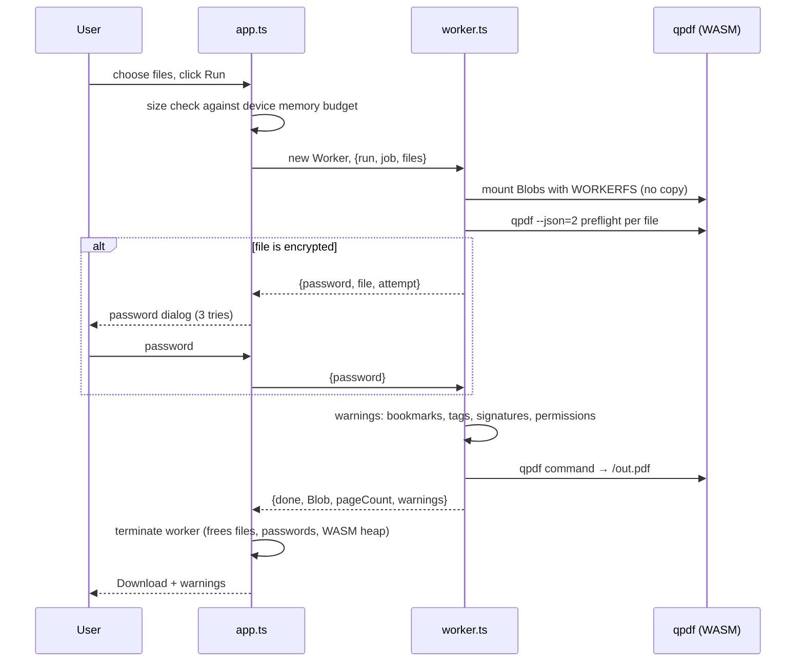

# Fizzdoc architecture

Fizzdoc is a static site. There is no backend: every document operation runs in the visitor's
browser, and the Content Security Policy (`connect-src 'self'`) stops the page from sending data
anywhere else.

## System overview

## Request flow for a PDF job (merge, split, rotate, delete, unlock, protect, clean)

## Modules

| Module | Responsibility | Depends on |
|---|---|---|
| `src/site.ts` | Single source of truth: brand, formats, every tool's slug and search copy | – |
| `src/seo.ts` | Renders each page, JSON-LD, sitemap, robots, llms.txt | `site.ts` |
| `vite.config.ts` | Serves pages in dev, emits one HTML file per tool at build | `seo.ts` |
| `src/app.ts` | Page controller: file intake, validation, job dispatch, result | engine types |
| `src/effects.ts` | Optional visual touches; transform/opacity only, honours reduced motion | – |
| `src/engine/worker.ts` | Worker entry: loads qpdf, mounts files, relays password prompts | `pdf.ts`, qpdf-wasm |
| `src/engine/pdf.ts` | Environment-agnostic qpdf runner: preflight, fidelity warnings, command | – |
| `src/engine/local.ts` | Jobs that don't need qpdf: Office metadata/images, JPG→PDF, PDF→JPG | fflate, pdf-lib, pdf.js |

## Design decisions

- **Static and client-only.** No server means no upload, no storage and no data to leak, and
  hosting costs nothing at any traffic level. It also scales with the visitor's device.
- **Disposable worker per qpdf job.** Terminating the worker is the cancel button and the cleanup:
  files, passwords and the WASM heap go away together. No shared state between jobs.
- **Lazy engines.** The first page load is about 15 KB of app code plus CSS and font. qpdf (1.3 MB),
  pdf.js and pdf-lib load only when a tool that needs them runs.
- **Fidelity is reported, not hidden.** `pdf.ts` inspects the input first and returns warnings
  for anything the output cannot carry over.
- **One registry drives everything.** Adding a tool means one entry in `site.ts`, one branch in
  the engine, and tests; pages, sitemap, footer links and llms.txt follow automatically.
- **Pure engine functions.** `pdf.ts` and `local.ts` take inputs and return outputs, so they are
  unit-tested in Node (`tests/engine.test.ts`, `tests/local.test.ts`); the UI is covered by
  Playwright (`tests/app.e2e.ts`), including a test that fails if any request leaves the origin.

## Known limits

- Maximum input size comes from reported device memory (128 MiB per GiB, capped at 1 GiB).
- `local.ts` jobs run on the main thread; very large PDF → JPG jobs keep every page image in
  memory until the ZIP is built.
- Compress, repair and Office → PDF are not offered: the available in-browser engines can't do
  them reliably yet.
